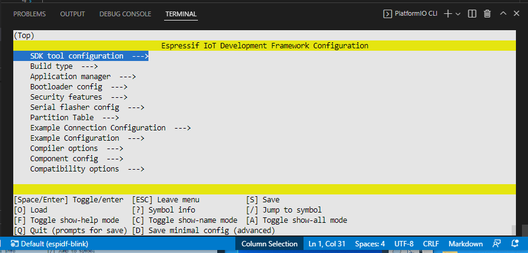
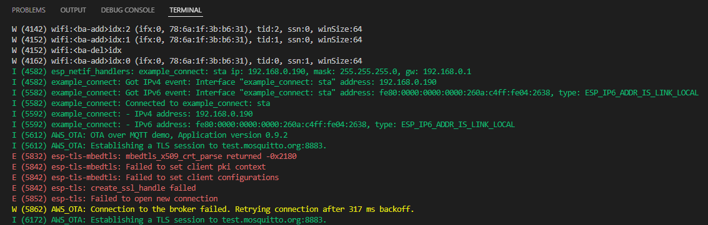

# PlatformIO AWS MQTT OTA Demo

 PlatformIO compilable version of https://github.com/espressif/esp-aws-iot/tree/master/examples/ota/ota_mqtt. 
 
 **Please** refer to its `README` above for the main documentation.

 ## Configuration

Go into the menuconfig just as [the documentation](https://docs.platformio.org/en/latest/frameworks/espidf.html#configuration-for-4-0) says.

Note that you possible have to use J/K to move up/down (https://github.com/platformio/platform-espressif32/issues/423) in the VSCOde CLI. 

Configure your WiFi credentials in "Example Connection Configuration" accordingly.

Configure your target MQTT broker in "Example Configuration" accordingly. By default, "testClient" client identifier against test.mosquitto.org:8883.

# Building and Uploading

Use the [project task](https://docs.platformio.org/en/latest/integration/ide/vscode.html#project-tasks) "Build" and "Upload" as normal.

## Output

Use the [project task](https://docs.platformio.org/en/latest/integration/ide/vscode.html#project-tasks) "Monitor" (or "Upload and Monitor") as normal.

With at least WiFi configured, you should be getting

Which is of course due to [main/certs/client.crt](main/certs/client.crt) and  [main/certs/client.key](main/certs/client.key) not being valid X509 certificate and key files at all. You have to generate them in accordance to the AWS documentation linked above.

Nothing further was tested, in particular not creating a TLS certificate + key and connecting to the AWS MQTT cloud -- this exercise is left to the reader. 